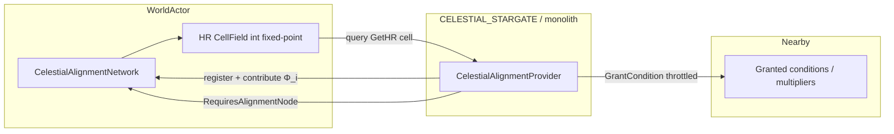

# Plan: CelestialAlignmentProvider (Harmonic Resonance Field)

**Status:** PHASE A IMPLEMENTED — `make all` + `utility.cmd cydonian --check-yaml` green.  
**Branch / worktree:** requested `feat/celestial-alignment-provider`; checkout has no `.git` — landed in working tree.

---

## 1. Goal

Expand the existing structure-attached `CelestialAlignmentProvider` so Nephilim monoliths / Stargates act as earthly anchors to Cydonian orbital cycles: they contribute a localized **Harmonic Resonance Level (HR)** that (a) powers nearby aligned structures via conditions and (b) feeds a world-level spatial field used to modulate terrain transit difficulty — all under the Acoustic Paradigm (frequency / resonance / falloff; no magic vocabulary).

**Done when:**

- Provider Info exposes required tunables with `[FieldLoader.Require]` + `[Desc]`.
- Hot path has zero allocations and zero trait lookups.
- `CELESTIAL_STARGATE` MiniYaml composition is lint-clean.
- `make` + `./utility.sh cydonian --check-yaml` observed green.

---

## 2. Current state (baseline — not greenfield)

| Artifact | Location | Today |
|---|---|---|
| Provider stub | `OpenRA.Mods.Cydonian/Traits/CelestialAlignmentProvider.cs` | Grants `Condition` while `CelestialAlignmentNetwork.IsLeylineActive`; caches network in `INotifyCreated` |
| Network clock | `OpenRA.Mods.Cydonian/Traits/CelestialAlignmentNetwork.cs` on World | CycleLength / ActiveDuration Leyline window |
| YAML sample | `mods/cydonian/rules/harmonics.yaml` → `RESONANCE.SPIRE` | Already attaches Provider (tabs indent — must normalize) |
| World registration | `mods/cydonian/rules/world.yaml` | `CelestialAlignmentNetwork` present |

Blueprint sample code in `Systems_Engineering_...md` uses `INotifyOwnerCreated`, `FindActorsInCircle` + `TraitOrDefault` inside Tick, and `float` math — **rejected** for this engine/mod performance doctrine.

---

## 3. Path / naming corrections (calibrated)

| Spec text | Actual repo path |
|---|---|
| `src/OpenRA.Mods.Cydonian/Traits/` | `OpenRA.Mods.Cydonian/Traits/` |
| `mods/cydonia/rules/` | `mods/cydonian/rules/` |

Assembly is already registered in `mods/cydonian/mod.yaml` (`OpenRA.Mods.Cydonian.dll`).

---

## 4. Canon check

- **Acoustic Paradigm:** HR is orbital-cycle × carrier-frequency physics, not mana.
- **Faction:** Provider targets Nephilim structures (Stargates / monoliths); Guardians do not own this trait in v1.
- **Oiketerion:** Effect is engineered Leyline tech (knowledge/tech), not innate Watcher power.
- **Raphael:** Out of scope (Tobit Protocol only) — no combat-unit coupling.

---

## 5. Architecture



### Responsibility split

| Type | Role |
|---|---|
| `CelestialAlignmentNetwork` (World) | Cosmic clock + **authoritative HR grid** + provider registry |
| `CelestialAlignmentProvider` (structure) | Emits Φ contribution into the grid; grants local power condition while aligned |
| Future (Phase B) | Path-cost consumer reading `GetHR(CPos)` — not engine Locomotor forks in Phase A |

---

## 6. Proposed class structure

### 6.1 `CelestialAlignmentProviderInfo : TraitInfo`

```csharp
[Desc("Projects a Leyline resonance field tied to Cydonian orbital alignment. " +
      "Attach to Nephilim Stargates / monoliths.")]
public class CelestialAlignmentProviderInfo : TraitInfo
{
    [FieldLoader.Require]
    [GrantedConditionReference]
    [Desc("Condition granted on this actor while celestially aligned.")]
    public readonly string Condition;

    [FieldLoader.Require]
    [Desc("Base tuning frequency Φ of this transceiver (Hz-equivalent int).")]
    public readonly int BaseFrequency;

    [FieldLoader.Require]
    [Desc("Spatial falloff radius of the Leyline resonance field.")]
    public readonly WDist ResonanceRadius;

    [FieldLoader.Require]
    [Desc("Decay scalar λ applied to HR contribution (fixed-point, 1024 = 1.0).")]
    public readonly int DecayScalar;

    [Desc("Only contribute / grant while CelestialAlignmentNetwork reports an active Leyline window.")]
    public readonly bool RequiresAlignmentNode = true;

    [Desc("Ticks between HR grid writes and proximity condition refresh (throttle hot path).")]
    public readonly int UpdateInterval = 5;

    public override object Create(ActorInitializer init)
        => new CelestialAlignmentProvider(init.Self, this);
}
```

**Note:** Existing optional defaults on `BaseFrequency` / `ResonanceRadius` will be removed for required fields so MiniYaml must supply them (fail-fast via FieldLoader).

### 6.2 `CelestialAlignmentProvider : ITick, INotifyCreated`

| Interface | Why |
|---|---|
| `INotifyCreated` | **Engine-correct** creation hook (release-20250330). Cache `CelestialAlignmentNetwork`, `CPos` origin, precompute `radiusSquared`, register with network. |
| `ITick` | Throttled HR contribution + condition grant/revoke. |

#### Interface correction (approval item)

Spec asked for `INotifyOwnerCreated`. **That interface does not exist** in this engine checkout (`engine/OpenRA.Game/Traits/TraitsInterfaces.cs` only defines `INotifyCreated`). Plan uses:

- `INotifyCreated.Created` — resolve & cache dependencies once
- `INotifyOwnerChanged` — only if ownership transfer must re-bind player-scoped state (not required for World network lookup in v1)

### 6.3 Cached fields (set in `Created`, never in `Tick`)

```text
readonly CelestialAlignmentProviderInfo info;
CelestialAlignmentNetwork network;   // WorldActor trait, cached
Actor self;                          // if needed beyond Tick arg
CPos originCell;                     // refreshed only on move if Mobile; Stargate is immobile → once
int radiusSquared;                   // from ResonanceRadius
int token;                           // condition token
int tickAccumulator;                 // throttle
```

### 6.4 `CelestialAlignmentNetwork` expansions (same PR)

Add to the existing World trait:

- `List`/`HashSet` of live providers registered/unregistered via `INotifyCreated` / `INotifyKilled` (or dispose path) on the Provider — **no per-tick world scans**.
- `CellLayer<int>` (or sparse map) of HR contributions, fixed-point.
- API: `bool IsLeylineActive`, `int GetHR(CPos cell)`, `void AddContribution(...)`, `void ClearContribution(Actor provider)` — all allocation-free on the tick path after warmup.
- Orbital factor `Ψ(t)` derived from existing cycle tick (integer phase), not `float`.

### 6.5 Fixed-point HR (desync-safe)

Blueprint:

\[
HR(x,y,t) = \sum_i \frac{\Phi_i \cdot \Psi_i(t)}{d_i^{2}}
\]

Implementation (integer only):

```text
psi = network.AlignmentFactorFixed;          // 0..1024 from cycle phase
contrib = (BaseFrequency * psi / 1024) * DecayScalar / 1024
cellHR += contrib / max(1, distCells * distCells)
```

No `float` / `double` in sim state. Gaussian falloff from the blueprint is **Phase B** (optional); Phase A uses inverse-square within `ResonanceRadius`.

---

## 7. Performance doctrine (Tick contract)

| Forbidden in `ITick` | Required |
|---|---|
| `self.Trait*` / `TraitOrDefault` | Cached refs from `INotifyCreated` |
| `FindActorsInCircle` every tick | Network-owned grid write by cell walk of precomputed footprint **or** throttled interval |
| `new`, LINQ, lambdas, string concat | Reuse `List<CPos>` footprint baked at Created |
| Per-actor `TraitOrDefault<Receiver>` scans | Condition grant on **self** + world HR query for consumers |

**Proximity powering (Phase A):** Grant/revoke condition on the **provider actor** (and optionally a short list of pre-registered receivers). Nearby structure “power” for v1 = consumers use `RequiresCondition` / `ExternalCondition` driven by a separate lightweight `HarmonicResonanceReceiver` **only if approved** — default is provider-self condition + FirepowerMultiplier pattern already on `RESONANCE.SPIRE`.

**Path / transit costs (Phase A vs B):**

| Phase | Deliverable |
|---|---|
| **A (this plan)** | Authoritative `GetHR(CPos)` on Network; document the transit-cost formula; no Locomotor fork |
| **B (follow-up plan)** | Consume HR via unit `SpeedMultiplier` in high-HR cells **or** custom movement-cost hook — OpenRA has no stock `IPathCostModifier`; Locomotor costs are terrain-index based |

Phase A still “manipulates transit costs” at the **data layer** (HR field ready); gameplay coupling lands in Phase B after you approve the consumption strategy.

---

## 8. MiniYaml integration

**File:** `mods/cydonian/rules/harmonics.yaml` (2-space indent — convert existing tabs).

```yaml
CELESTIAL_STARGATE:
  Inherits: example
  RenderSprites:
    Image: example
  CelestialAlignmentProvider:
    Condition: celestially-aligned
    BaseFrequency: 1024
    ResonanceRadius: 8c0
    DecayScalar: 1024
    RequiresAlignmentNode: true
    UpdateInterval: 5
  FirepowerMultiplier@ALIGNED:
    RequiresCondition: celestially-aligned
    Modifier: 150
```

- Keep `RESONANCE.SPIRE` Provider block in sync with new required fields (`DecayScalar`).
- World actor unchanged except any new Network YAML knobs (optional `HrScale`).
- No `&` / `*` anchors. Use `Inherits` / `@` labels only.

---

## 9. Build order (post-approval)

1. Create worktree: `git worktree add ../OpenRA-CH-cap feat/celestial-alignment-provider` (or equivalent).
2. Expand `CelestialAlignmentNetwork` (registry + HR grid + `GetHR`).
3. Expand `CelestialAlignmentProvider` Info/runtime per §6.
4. Update `harmonics.yaml`: add `CELESTIAL_STARGATE`, fix indent, supply required fields.
5. Add focused unit tests under mod test project if present; else a minimal deterministic HR math test harness agreed in review.
6. Verify loop: `make` → `./utility.sh cydonian --check-yaml` → fix until clean (`bash .cursor/hooks/grind.sh` when instructed).
7. Update `.claude/docs/engine-traits.md` CelestialAlignmentProvider section to match reality (structure trait + Network HR grid).

---

## 10. Risks

| Risk | Mitigation |
|---|---|
| Spec `INotifyOwnerCreated` vs engine | Use `INotifyCreated`; document in code comment |
| Hot-path cell stamps on large radius | Footprint bake + `UpdateInterval`; cap radius in YAML review |
| Desync from float HR | Fixed-point only |
| Pathfinding integration scope creep | Phase B gate — approve consumption strategy separately |
| Existing YAML tabs | Normalize to 2-space in same PR |
| Blueprint `FindActorsInCircle` sample | Do not port; use registry + grid |

---

## 11. Approval checklist (reply with decisions)

Please confirm or amend:

1. **Creation hook:** Approve `INotifyCreated` (not `INotifyOwnerCreated`)?
2. **Phase A scope:** HR grid + self condition grant; path-cost consumption deferred to Phase B?
3. **Required Info fields:** `Condition`, `BaseFrequency`, `ResonanceRadius`, `DecayScalar` all `[FieldLoader.Require]`?
4. **Actor key:** `CELESTIAL_STARGATE` in `harmonics.yaml` (plus update `RESONANCE.SPIRE`)?
5. **Worktree name/path:** `feat/celestial-alignment-provider` OK?

---

*No C# generation or worktree creation until this plan is explicitly approved.*
