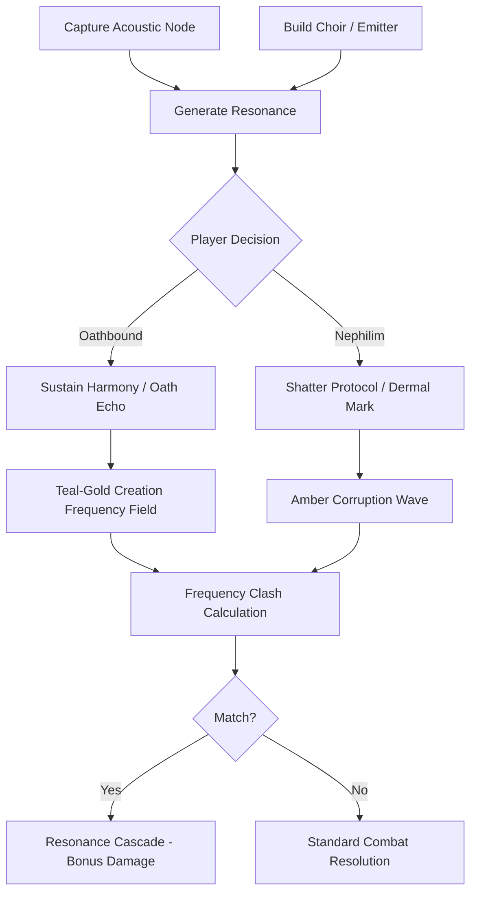
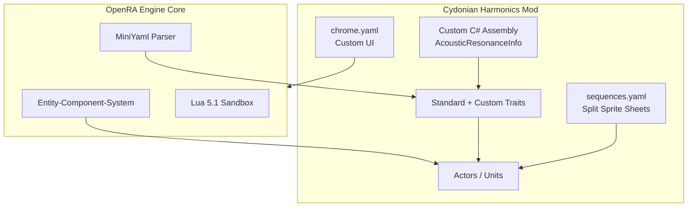
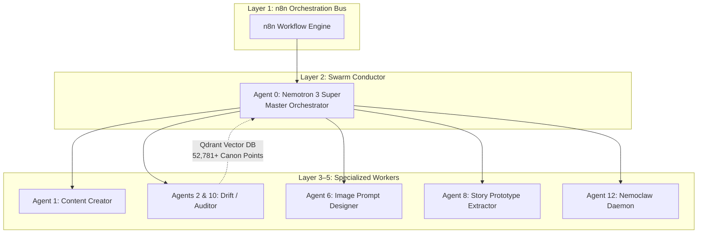
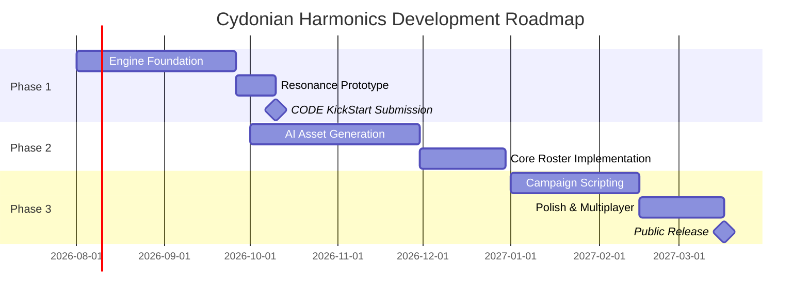

# Strategic and Technical Blueprint for "Cydonian Harmonics"

## Transmedia Expansion via OpenRA Total Conversion

**Prepared by:** Kerman Gild Publishing  
**Author:** Christopher Modina (Kerman Gill)  
**Date:** July 2026  
**Version:** 1.0  
**Classification:** Internal Strategic Document / Grant Application Support Material  

---

## Table of Contents

1. [Executive Summary and Transmedia Synergy](#1-executive-summary-and-transmedia-synergy)
2. [Cosmology, Lore Integration, and Canonical Translation](#2-cosmology-lore-integration-and-canonical-translation)
3. [Faction Architecture and Roster Dynamics](#3-faction-architecture-and-roster-dynamics)
4. [The Acoustic Paradigm and Resonance Mechanics](#4-the-acoustic-paradigm-and-resonance-mechanics)
5. [OpenRA Engine Architecture and Technical Customization](#5-openra-engine-architecture-and-technical-customization)
6. [Audio-Visual Direction and Asset Pipeline](#6-audio-visual-direction-and-asset-pipeline)
7. [Campaign Design and Lua Scripting](#7-campaign-design-and-lua-scripting)
8. [The HAWK 5-Layer AI Agent Swarm Integration](#8-the-hawk-5-layer-ai-agent-swarm-integration)
9. [Funding and Commercialization Strategy](#9-funding-and-commercialization-strategy)
10. [Development Roadmap and Risk Mitigation](#10-development-roadmap-and-risk-mitigation)
11. [Strategic Conclusions](#11-strategic-conclusions)
12. [Appendices](#12-appendices)

---

## 1. Executive Summary and Transmedia Synergy

The contemporary intellectual property landscape overwhelmingly rewards franchises that successfully bridge static narrative mediums with interactive digital experiences. **"Cydonian Harmonics,"** conceptualized as a grimdark, asymmetric real-time strategy (RTS) total conversion modification utilizing the OpenRA engine, represents a highly synergistic and commercially viable expansion of *The Nephilim Chronicles* universe.

By translating the franchise's deep cosmological lore, rigid Binitarian theological framework, and fundamental **"Acoustic Paradigm"** into tangible, interactive mechanics, this initiative serves a vital dual mandate:

1. **Audience Expansion** — It establishes an accessible, highly engaging entry point for new audiences, acting as a top-of-funnel marketing vehicle for the core literary works published by Kerman Gild Publishing.
2. **Monetization** — It monetizes existing narrative assets through a commercially viable indie game product, leveraging a mature, open-source software architecture.

The selection of the **OpenRA** engine is a strategic masterstroke. Originally engineered to recreate classic Westwood Studios titles such as *Command & Conquer: Red Alert* and *Tiberian Dawn*, OpenRA has evolved into a robust, data-driven framework written in C# and structured around an Entity-Component-System (ECS). This architecture allows developers to define complex game logic through declarative MiniYaml configuration files and Lua scripting, heavily reducing the requirement for native engine compilation while enabling rapid prototyping. Furthermore, the engine natively supports modern RTS expectations, including fog of war, high-resolution rendering, asynchronous multiplayer, and sophisticated pathfinding algorithms.

This report provides an exhaustive technical, creative, and commercial roadmap for developing *Cydonian Harmonics*. It analyzes the integration of the franchise's strict canonical parameters into asymmetric faction design, details the software engineering requirements for implementing a novel **"Resonance"** resource economy, outlines a production pipeline augmented by the proprietary **HAWK 5-Layer AI Agent Swarm**, and synthesizes a commercialization strategy targeting New Zealand-based game development and literary funding streams.

Ultimately, this 2D RTS project acts as the perfect companion and entry point for the universe, paving the way for the future **"Project Cydonian Soulsvania"** built in Unity DOTS.

*Figure 1: Conceptual visualization of a late-game engagement between Oathbound Guardians (teal-gold harmonics) and Nephilim Collective forces (amber corruption frequencies).*

---

## 2. Cosmology, Lore Integration, and Canonical Translation

Translating *The Nephilim Chronicles* into a real-time strategy environment demands uncompromising adherence to the Master Lore Book, specifically the Constitutional Axioms and the Canon Authority Hierarchy. The game must expand the universe safely through "what if" scenarios and direct adaptations of key events without introducing continuity drift across the four published and drafted manuscripts.

### Core Theological Constraints

The universe is governed by a strict **Binitarian** theological framework, explicitly recognizing the Godhead as a Family of Two Persons (the Father and the Son), with the Holy Spirit functioning as the projecting power of God rather than a distinct third person. This stricture must be maintained in all in-game codex entries, campaign dialogue, and faction descriptions, completely avoiding Trinitarian terminology.

Furthermore, the antagonist forces are commanded by the **Satanic Triumvirate**—an operational command hierarchy comprising:

- **Satan** (The Empowerer)
- **Ohya** (The Beast / Political Ruler)
- **Azazel** (The False Prophet / Tech Enforcer)

This hierarchy must **never** be referred to as an "Unholy Trinity."

### The Acoustic Paradigm

The conflict is not characterized by standard terrestrial warfare, but rather by an underlying acoustic physics where combat relies on harmonic resonance and frequency manipulation. This concept is rooted in the **"Oiketerion Principle."**

Following the Watcher Fall at Mount Hermon in 3504 BCE, the 200 Watchers lost their inherent supernatural capabilities upon shedding their celestial bodies. Consequently, they rely entirely on advanced technology—specifically acoustic metamaterials like Cydonian ore—to replicate these lost abilities. This establishes the Nephilim Collective as a hyper-technological, rigidly structured military force that uses applied physics, contrasting sharply with the Oathbound Guardians, who rely on spiritual resilience, defensive warding, and creation harmonics.

### Canonical Translation Matrix

| Canonical Principle          | Narrative Function                                                                 | Gameplay Translation                                                                 |
|-----------------------------|------------------------------------------------------------------------------------|--------------------------------------------------------------------------------------|
| **Acoustic Paradigm**       | All supernatural phenomena operate via frequencies and harmonic resonance, not magic. | Replaces standard magic/mana systems with a map-wide "Resonance" economy and frequency-matching mechanics. |
| **Oiketerion Principle**    | Watchers lost innate power when leaving their celestial domain, relying on technology to emulate miracles. | Antagonist faction relies on heavy, stationary emitters, monoliths, and technological infrastructure to project power. |
| **Satan as Trafficker**     | Satan (Ezekiel 28) operates via transactional compromise, requiring a willing sacrifice or broken authority structure. | Nephilim faction mechanic allowing the sacrifice of their own units to temporarily break unit caps or accelerate production queues. |
| **The Ban (Angelic Limitation)** | Angels cannot intervene directly against human proxies, only against supernatural violations. | Angelic "support powers" are heavily restricted, featuring massive cooldowns or operational dead-zones if human enemy units are present. |
| **Time Dilation (Eden)**    | Time within Eden moves significantly faster relative to the terrestrial plane (Narnia-style). | Specific campaign missions feature hyper-accelerated build times and resource generation to simulate subjective time. |

---

## 3. Faction Architecture and Roster Dynamics

The core concept relies on an asymmetric faction design that reflects the thematic dichotomy of **grace versus oaths**, and **creation versus corruption**. The initial viable product will launch with two highly polished factions, ensuring deep interplay and tactical variety.

### 3.1 The Oathbound Guardians

The Oathbound Guardians serve as the protagonist faction, visually defined by an ancient-future grimdark aesthetic featuring:

- Patched exoskeletons
- Cold tactical blues and blacks
- Teal-gold creation harmonics

Their gameplay loop centers on extreme defensive resilience, highly specialized hero units, and sustained harmonic buffs that allow small squads to survive massive attrition.

The roster focuses on elite, low-unit-count tactical combinations. Infantry units are sustained by localized **"Choir"** structures that emit defensive frequencies based on the 7.83 Hz Schumann resonance. The faction's operational capabilities are built around the concept of the **"Creation Frequency"**—the foundational acoustic signature of the universe. Structures and units project this frequency to unravel enemy wards and maintain unit cohesion under heavy bombardment.

#### Key Hero Units

| Hero                  | Role                              | Signature Mechanic                                                                 | Narrative Anchor |
|-----------------------|-----------------------------------|------------------------------------------------------------------------------------|------------------|
| **Cian mac Morna**   | Primary melee / anti-ward specialist | Passive teal acoustic aura that rapidly degrades enemy shielding and unravels Watcher-grade wards | 2,636-year-old Knight of the Craobh Ruadh; Mo Chrá (forged by Enoch from Cydonian ore) acts as localized Universal Anchor |
| **Miriam Ashford**   | Acoustic conduit / support        | Projects harmonic waves that render surrounding units immune to specific Nephilim corruption debuffs | Spirit-signature tuned identically to the Creation Frequency; armed with Muromachi katana |
| **Brennan McNeeve**  | Engineering / tech specialist     | Deploys drone networks and reverse-engineered Watcher technology; "Enochian Faraday cage" mechanic | Shields units from Azazel's sub-audible dermal marking systems |

**Critical Design Constraint — Angelic Intervention:**  
Raphael (known strictly as **"Liaigh"** to the player character) cannot function as a standard combat unit due to the "Three Limitations." Instead, his presence is invoked through a high-impact, late-game support power—the **"Tobit Protocol"**—which temporarily binds supernatural enemies across a wide radius. However, this ability is dynamically disabled during scripted times of day representing the Heavenly Liturgy (e.g., 9–10 AM, 3–4 PM).

### 3.2 The Nephilim Collective

The Nephilim Collective, representing the Watcher remnants and their hybrid offspring, operates as a swarm-tech hybrid faction. Visually dominated by amber corruption tones and brutal, biomechanical structures, this faction relies on frequency emitters that actively debuff, disrupt, and demoralize Oathbound forces.

The faction's map control is dictated by the deployment of **monoliths**—massive acoustic tuning forks modeled after the structures found at Cydonia-1 on Mars. These structures harvest disrupted ambient frequencies, generating Resonance at a massive scale. Nephilim units utilize corrupted harmonics to shred enemy armor and suppress healing auras.

#### Key Hero Units (Satanic Triumvirate Manifestations)

| Hero                  | Role                              | Signature Mechanic                                                                 | Canonical Note |
|-----------------------|-----------------------------------|------------------------------------------------------------------------------------|----------------|
| **Azazel** (as Dr. Ezra Adon) | Technological enforcer / Mark architect | Deploys "Layer One" dermal marking frequencies (permanent reveal through fog of war) followed by "Layer Two" health-draining tethers | **Must be tagged as Nephilim** (son of Gadreel), **not** a Watcher |
| **Ohya** (The Beast) | Late-game juggernaut              | Summoned via "Fourth Seal" protocol; wide-radius morale destroyer reducing movement and attack speed of non-hero Oathbound units | Pure destruction archetype |
| **Naamah** (The Whore of Babylon) | Stealth / subversion specialist | Mind-controls standard infantry and hijacks resource nodes | Survived the Flood as a Siren; mother of the Mystery Babylon system |

---

## 4. The Acoustic Paradigm and Resonance Mechanics

The defining mechanical innovation of *Cydonian Harmonics* is the translation of the franchise's Acoustic Paradigm into a tangible RTS resource economy.

In *The Nephilim Chronicles*, every device, material, and system operates through specific frequencies and harmonic resonances rather than electromagnetic radiation or chemical reactions. To mirror this, the mod must expand OpenRA's default resource logic (which typically revolves around harvesting physical fields like ore or tiberium) to include **"Resonance"** as an invisible, map-wide acoustic economy.

### Dual-State Resource Model

Resonance is generated:

- **Actively** by capturing and holding acoustic nodes (ancient monoliths, geological fault lines, or Cydonian ore deposits)
- **Passively** by constructing specialized broadcasting structures (e.g., Oathbound "Choirs")

Unlike standard currency, Resonance represents the acoustic tension and harmony of the battlefield. Mismanagement of this resource has consequences, directly echoing the tension-building mechanics of the novels.

### Resonance Abilities Matrix

| Ability              | Faction     | Mechanism                                                                 | Visual / Audio Feedback                                      |
|----------------------|-------------|---------------------------------------------------------------------------|--------------------------------------------------------------|
| **Shatter Protocol** | Nephilim   | Spends Resonance to project a concentrated counter-frequency, instantly stripping armor buffs and dealing massive structural damage to a target area | Amber frequency waves, shattering glass sound effects, deep resonant drone |
| **Sustain Harmony**  | Oathbound  | Expends Resonance to lock the Creation Frequency over a zone, granting rapid cellular regeneration and warding against debuffs | Pulsing teal-gold fields, high-pitch harmonic singing, glowing runes on terrain |
| **Oath Echo**        | Oathbound  | Revives fallen elite infantry within a specific radius or temporarily empowers living units with the combat memories of their ancestors | Subsonic pulse, phantom silhouettes overlaying active units |
| **Dermal Mark**      | Nephilim   | Sub-audible frequency tag applied to enemy units, providing permanent line-of-sight and enabling secondary possession attacks | Static interference on the UI, dull amber glow on tagged units |

### Dynamic Frequency Matching

A secondary layer of the Resonance system involves dynamic frequency matching. Units and structures emit specific acoustic signatures. When opposing units clash, the engine must calculate the interaction of their frequencies. If an Oathbound player utilizes a frequency that counters the Nephilim armor type, a **resonance cascade** occurs, granting massive bonus damage. This rock-paper-scissors mechanic rewards deep tactical play and precise micro-management over simple "attack-move" swarm tactics.

---

## 5. OpenRA Engine Architecture and Technical Customization

Developing a total conversion of this magnitude requires a deep understanding of OpenRA's underlying architecture. OpenRA is built on a highly modular **Entity-Component-System (ECS)**. In this paradigm, "Actors" (units, buildings, projectiles) are empty vessels that receive their functionality from "Traits" (components) defined in MiniYaml files. The engine is open-source (GPLv3+) and actively maintained, making it the premier platform for 2D RTS development.

### MiniYaml and Trait Composition

MiniYaml is a textual, indentation-driven configuration format utilized by OpenRA to assemble game logic. Modders do not write raw code for standard unit behaviors; instead, they compose traits. For example, a standard actor is composed of engine-provided traits such as:

- `Mobile` (for movement)
- `Health` (for hit points)
- `Armament` (for weapons)
- `RenderSprites` (for visual output)

To manage the massive scale of a total conversion, the development pipeline must heavily utilize YAML templates, anchors (`&`), and aliases (`*`). OpenRA supports an `Inherits: ^TemplateName` key, which allows the developer to define a baseline unit (e.g., `^OathboundInfantry`) and inherit those properties across multiple specialized units, overriding only the specific traits that differ. This prevents file bloat, reduces memory allocation overhead, and ensures that sweeping balance changes can be made by altering a single template.

### Sprite Rendering, Metadata, and Asset Optimization

One of the primary technical bottlenecks in the OpenRA engine is the texture rendering limit. Historically, OpenRA capped sprite sheets at a maximum resolution of 2048×2048 pixels. While modern implementations have softened these hard caps, packing massive, multi-directional 8K-styled grimdark assets into single sheets will cause the engine to crash or fail to allocate texture memory, leading to severe stuttering due to high draw calls.

**Mitigation Strategy:**

1. Dynamically split asset sequences. Instead of packing all 32 rotational frames of a heavy Nephilim walker into one massive file, the sequences must be divided into separate PNG files (e.g., one file per facing direction or animation state) and referenced individually within the `sequences.yaml` file.
2. Drop the frame count of secondary units from 32 smooth rotations down to 16 or 8 frames. This drastically reclaims texture space without severely impacting the isometric visual presentation.
3. Utilize `OpenRA.Utility.exe --png-sheet-import` to bake YAML metadata directly into the PNG files generated by the AI concept art pipeline.
4. Strictly manage palettes. OpenRA relies on 256-color indexed palettes for player colors and environmental effects. Sharing global palettes across both the Oathbound and Nephilim factions prevents the engine from overloading texture memory during massive 8-player skirmishes.

### Custom C# Traits and Assembly

While MiniYaml handles standard composition, the unique Resonance economy and dynamic frequency wave interactions require bespoke logic written in C#. OpenRA allows modders to compile custom C# assemblies (`.dll` files) and link them to the engine via the `mod.yaml` manifest using the `Assemblies:` directive.

A custom `AcousticResonanceInfo` trait must be authored to handle the generation, expenditure, and area-of-effect calculations of the new resource, entirely overriding the default `PlayerResources` logic. Additional custom traits will be required to calculate dynamic damage modifiers based on proximity and active frequency states, providing the visual feedback (teal-gold vs. amber waves) required by the lore.

To ensure maximum stability, the mod should be built as a **standalone engine runtime** using the OpenRA Mod SDK, completely bypassing the system memory strain caused by the game's default multi-mod chooser interface.

---

## 6. Audio-Visual Direction and Asset Pipeline

The visual identity of *Cydonian Harmonics* must precisely match the Book 4 grimdark tactical aesthetic: a Warhammer 40K-inspired weight featuring patched exoskeletons, obscured faces, cold tactical blues, and hyper-detailed textures translated into OpenRA's 2D sprite style.

**Critical Visual Rules:**

- Celestial entities (Cherubim or Watcher remnants) must **never** be humanized visually; they are to be represented with terrifying, non-human proportions and geometric precision, utilizing acoustic light rather than standard illumination.
- UI will be heavily customized via `chrome.yaml`, replacing the standard Westwood aesthetic with a sleek, ancient-future military interface that prioritizes tactical readability.

### Audio Design Philosophy

In an acoustic-driven universe, sound effects cannot be generic explosions. Weapons must produce clashing frequencies, deep resonant drones, and shattering effects. Character voices will be generated using **Grok TTS**, meticulously tuned to match the canonical registers:

- Cian's world-weary Irish cadence
- The meticulous precision of Enoch the Scribe
- The divine, capitalized gravitas of Raphael's Empyreal Register

**Performance Optimization:**  
Audio files—especially high-fidelity voice lines and continuous ambient background music—must be downsampled. Converting custom unit responses and background tracks into compressed `.aud` or low-bitrate `.wav` formats native to the OpenRA audio interpreter is mandatory to prevent massive memory strains during late-game engagements.

---

## 7. Campaign Design and Lua Scripting

OpenRA utilizes **Lua 5.1** running in a secured sandbox to govern single-player campaigns and dynamic map events. The Lua API exposes global tables (`Actor`, `Map`, `Player`, `DateTime`, `Utils`) that allow developers to script highly complex mission objectives. Map scripting is achieved by attaching a `LuaScript` trait to the World actor within the map's rules.

### Campaign Arcs

The single-player campaign will adapt key arcs from the books, including:

- The **Mars Monolith Defense** (utilizing custom Martian tilesets)
- The **Dudael Breach** in Antarctica
- The final eschatological defense of Jerusalem

### Key Lua API Applications

| Lua API Element          | Function                                      | Application in *Cydonian Harmonics* |
|--------------------------|-----------------------------------------------|-------------------------------------|
| `DateTime.GameTime`     | Retrieves current game time in ticks         | **Time Dilation Mechanics:** During missions set in Eden, scripts accelerate resource ticks and build queues to simulate Narnia-style time dilation |
| `Map.ActorsInCircle`    | Returns a table of actors within a specific radius | **Acoustic Shockwaves:** Triggers instant damage or debuff states to all units caught within the blast radius of a shattered Nephilim Monolith or an overloaded Choir structure |
| `Player.Resources`      | Modifies or queries player resource balances | **Operational Silence:** Scripts drain Resonance generation to zero during specific narrative beats (representing the severed link between Cian and Raphael) |
| `Actor.Create`          | Spawns new actors into the world at runtime  | **The Dudael Breach:** Dynamically spawns Azazel's biomechanical swarms from specific map coordinates once the player's expedition triggers the ice-shelf breach event |
| `Utils.All`             | Boolean check across a collection of elements | **Ward Verification:** Checks if all required harmonic nodes are active simultaneously to lower a massive Nephilim forcefield |

### Operational Silence Mechanic

A critical narrative mechanic is **"Operational Silence."** Adapting the devastating events of Book 3, Chapter 14, where Cian's communication with Raphael is fully severed, specific missions will enforce an Operational Silence phase. During these phases, Lua scripts will:

- Disable radar capabilities
- Completely block access to angelic support powers
- Silence the Empyreal Register UI notifications

This forces the player to rely on "Phantom Banter" and extreme tactical caution until the communication link is restored.

---

## 8. The HAWK 5-Layer AI Agent Swarm Integration

The production of *Cydonian Harmonics* will be exponentially accelerated by integrating the development pipeline into Kerman Gild Publishing's existing **HAWK (Hierarchical Agent Workflow) 5-Layer AI Agent Swarm**.

This 13-agent hybrid network, orchestrated by n8n and powered by Nemotron 3 Super and local Ollama models, provides an unprecedented advantage, effectively operating as a virtual game studio.

The HAWK topology ensures that all inter-agent traffic passes through Layer 2 (the Swarm Conductor) or the Layer 1 n8n bus, eliminating deadlocks and enforcing strict auditability.

### Agent Responsibilities

| Agent ID | Role                              | Primary Function |
|----------|-----------------------------------|------------------|
| **0**    | Swarm Conductor (Nemotron 3 Super) | Master orchestrator. Decomposes the game design document into actionable YAML drafting, Lua scripting, and art generation tasks |
| **1**    | Content Creator                   | Drafts in-game codex snippets, mission briefing text, and localized dialogue with perfect character cadences |
| **2 & 10** | Drift Manager & Cross-Book Auditor | Utilizes Qdrant vector database (52,781+ points of canonical data) to perform semantic searches against custom YAML definitions. Ensures zero lore contradictions (e.g., Azazel correctly tagged as Nephilim) |
| **6**    | Image Prompt Designer             | Cascades through a 4-tier Nemotron router to generate highly specific, optimized prompts for external image models. Guarantees visual consistency |
| **8**    | Story Prototype Extractor         | Translates causal event chains stored in the `tnc_plot_graph` Qdrant collection into logical flowcharts for Lua mission scripts |
| **12**   | Nemoclaw Daemon                   | Background file watcher utilizing Conflict-free Replicated Data Types (CRDTs) to manage asynchronous outputs and prevent simultaneous AI edits from corrupting OpenRA YAML files |

---

## 9. Funding and Commercialization Strategy

Transitioning *Cydonian Harmonics* from a conceptual mod to a polished commercial product requires capital. While the project is structurally an open-source modification, commercial release of total conversions is legally viable under the GPLv3+ provided the modified engine source is distributed, while the original artwork, sounds, and narrative data remain proprietary.

To finance the asset generation and audio synthesis without draining the publisher's core literary revenue, the project will aggressively target New Zealand's lucrative, government-backed funding structures.

### 9.1 CODE (Centre of Digital Excellence) Grants

The primary vehicle for funding is the **Centre of Digital Excellence (CODE)**, an initiative funded by the Ministry of Business, Innovation and Employment (MBIE). CODE's mandate is to support the Aotearoa game development ecosystem, boasting a remarkable 40% success rate for supported studios securing international publishing deals. Recent structural changes to CODE's Round 12 funding have merged the Dunedin and National grant pools, making these funds highly accessible for Auckland-based developers.

| Funding Tier          | Amount                  | Purpose                                                                 | Key Requirement |
|-----------------------|-------------------------|-------------------------------------------------------------------------|-----------------|
| **KickStart**        | $10,000 – $60,000      | Innovative working prototypes that have "found the fun" with a functioning core gameplay loop | Polished vertical slice demonstrating Resonance mechanics |
| **StartUp**          | Up to $250,000         | Full realization of a shared vision with profound commercial prospects | 60/40 breakpoint with independent Market Validation audit |
| **Travel Grants**    | Up to $14,000          | International commercialization outcomes (Gamescom, PAX AUS)           | Presentation of prototype to core RTS audiences |

**Market Validation Strategy:**  
Kerman Gild Publishing will deploy AI Agents 9 and 13 (Content Strategist and Marketing Agent) to aggressively build a community via TikTok, X (@RevrSingularity), and YouTube. By demonstrating an existing, highly engaged readership of *The Nephilim Chronicles* that is eager to purchase the interactive companion, the studio can provide incontrovertible market validation during the CODE audit process.

### 9.2 Mātātuhi Foundation Grants

A secondary, highly strategic funding avenue is the **Mātātuhi Foundation**. Established by the Auckland Writers Festival, the foundation aims to support the development of New Zealand's literary landscape and recently increased its maximum project grant to $20,000.

While the foundation strictly excludes funding for pure screenwriting or standard performance-based projects, it explicitly funds projects that develop a "sustainable literary platform to grow awareness and readership of New Zealand books and writers."

*Cydonian Harmonics* will be pitched **not merely as a video game**, but as an interactive, digital codex—a transmedia platform designed specifically to drive engagement with a New Zealand author's literary universe. The in-game lore library, narrative campaigns, and TTS-driven story integration serve as a profound literature delivery system.

---

## 10. Development Roadmap and Risk Mitigation

To ensure project feasibility and completely eliminate scope creep—a notorious killer of total conversion mods—the development must follow a strict, phased roadmap optimized for a solo indie developer supported by AI automation.

### Phased Roadmap

| Phase | Timeline          | Primary Focus                                      | Key Deliverable |
|-------|-------------------|----------------------------------------------------|-----------------|
| **1** | Weeks 1–8        | Engine Foundation and Prototyping                 | Playable grey-box skirmish map verifying Resonance economy (CODE KickStart submission) |
| **2** | Months 3–6       | Asset Pipeline and Core Roster                    | 4–6 core units + 3–4 specialized structures per faction; full visual/audio replacement |
| **3** | Months 7–9       | Lua Campaign Scripting, Polish, and Release       | Full single-player campaign + multiplayer balance; distribution on ModDB, itch.io |

### Risk Mitigation

| Risk Category              | Description                                                                 | Mitigation Strategy |
|----------------------------|-----------------------------------------------------------------------------|---------------------|
| **Technical – Texture Limits** | Asset overload causes engine crashes or severe stuttering                  | Sequence splitting, reduced frame counts (16/8), unified global palettes |
| **Canonical Drift**        | Divergence from lore alienates core readership                             | Continuous enforcement by Agent 2 (Drift Manager) and Agent 10 (Cross-Book Auditor) against SERIES_BIBLE.md (Tier 1) |
| **Scope Creep**            | Feature expansion kills project timeline                                   | Strict roster limits (4–6 units + 3–4 structures per faction); phased gates |
| **Funding Delay**          | CODE or Mātātuhi timelines slip                                            | Vertical slice prioritized for KickStart; parallel community building for Market Validation |

---

## 11. Strategic Conclusions

*Cydonian Harmonics* represents a highly sophisticated synthesis of literary worldbuilding and software engineering. By adapting the grimdark, acoustically driven universe of *The Nephilim Chronicles* into the mature, open-source architecture of OpenRA, Kerman Gild Publishing can successfully execute a transmedia franchise expansion that significantly broadens its audience reach.

The strategic utilization of the HAWK AI Agent Swarm guarantees a rapid, highly accurate production pipeline, allowing a solo developer or small team to output industry-standard YAML configurations, complex Lua scripts, and optimized sprite sheets without sacrificing canonical integrity.

Crucially, the financial viability of this project is highly achievable by aligning the development cycle with New Zealand's aggressive investment in digital media and literary platforms. By securing KickStart and StartUp funding through CODE, alongside strategic literary platform grants from the Mātātuhi Foundation, the financial risk is largely absorbed by institutional partners.

The resulting product will stand not only as a mechanically unique real-time strategy experience but as a powerful, interactive marketing engine driving sustained engagement and revenue toward the franchise's core literary manuscripts, perfectly bridging the gap toward future 3D interactive endeavors (*Project Cydonian Soulsvania*).

---

## 12. Appendices

### Appendix A: Glossary of Key Terms

- **Acoustic Paradigm** — The foundational physics of the Nephilim Chronicles universe in which all supernatural phenomena operate via frequencies and harmonic resonance.
- **Binitarian Framework** — Theological structure recognizing the Godhead as Father and Son, with the Holy Spirit as the projecting power of God.
- **Creation Frequency** — The foundational acoustic signature of the universe; primary power source for Oathbound Guardians.
- **Oiketerion Principle** — Watchers lost innate power upon leaving their celestial domain and must use technology to emulate former abilities.
- **Operational Silence** — Narrative and mechanical state in which angelic communication and support powers are fully severed.
- **Resonance** — The dual-state map-wide acoustic resource unique to *Cydonian Harmonics*.
- **Satanic Triumvirate** — Operational hierarchy of Satan, Ohya, and Azazel (never to be called an "Unholy Trinity").

### Appendix B: Recommended Next Actions

1. Finalize vertical-slice design document for CODE KickStart application.
2. Stand up OpenRA Mod SDK standalone runtime.
3. Begin Agent 0 task decomposition of this blueprint into actionable YAML / Lua tickets.
4. Commission initial concept art batch via Agent 6 for the two core factions.

---

**Document Control**  
Prepared for internal strategy and external grant applications.  
© 2026 Kerman Gild Publishing. All rights reserved.  
*The Nephilim Chronicles* and all related characters, lore, and concepts are the intellectual property of Christopher Modina / Kerman Gill.
