# Cydonian Harmonics

**Asymmetric real-time strategy total conversion on the [OpenRA](https://github.com/OpenRA/OpenRA) engine.**

Oathbound Guardians and the Nephilim Collective contest **Resonance** across Mars-Cydonia and Earth flashpoints. Every supernatural effect traces to the **Acoustic Paradigm** — sound and frequency as root physic. There is no mana, magic, or psionics vocabulary.

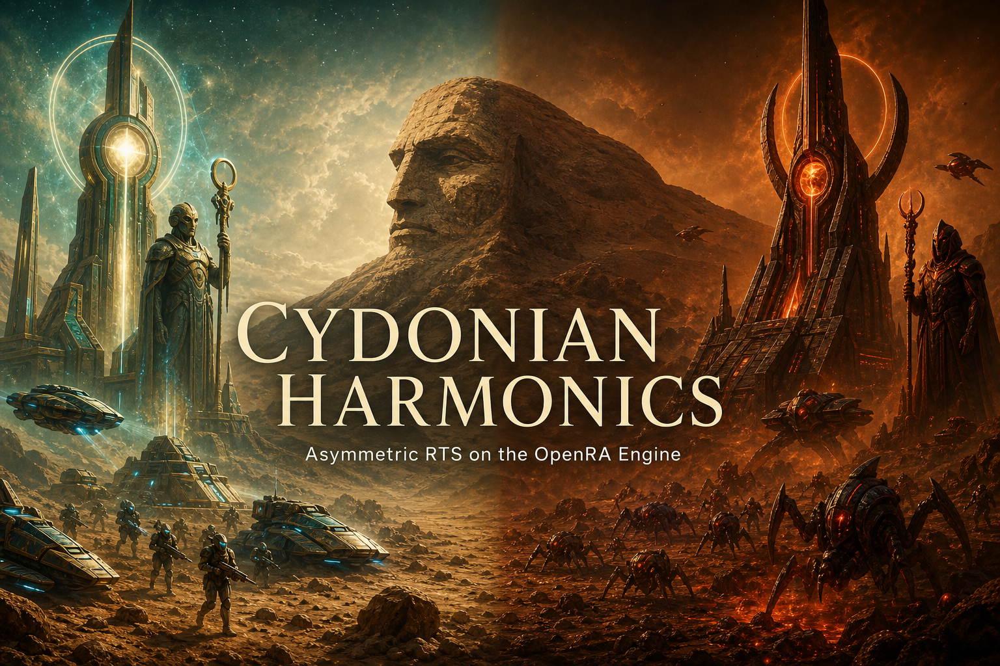

| Field | Value |
|---|---|
| Engine | OpenRA `release-20250330` |
| Mod ID | `cydonian` |
| Language | C# / .NET + MiniYaml + Lua 5.1 |
| License (engine/SDK/code) | [GPLv3](COPYING) |
| Current milestone | Phase J campaign scripting + release packaging (`release-20260719`) |
| Grant target | CODE KickStart standalone installers |

---

## Table of contents

1. [Factions](#factions)
2. [Acoustic Paradigm and Resonance](#acoustic-paradigm-and-resonance)
3. [Architecture](#architecture)
4. [Campaign scripting (Phase J)](#campaign-scripting-phase-j)
5. [Development roadmap](#development-roadmap)
6. [Build and run](#build-and-run)
7. [Release packaging](#release-packaging)
8. [Repository map](#repository-map)
9. [Canon hard lines](#canon-hard-lines)
10. [Governance and contributing](#governance-and-contributing)
11. [Documentation index](#documentation-index)

---

## Factions

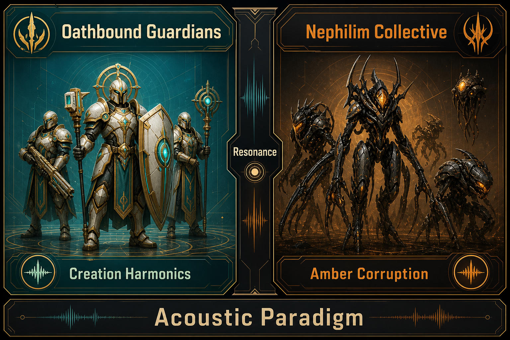

| Faction | Signature | Playstyle | Key units / powers |
|---|---|---|---|
| **Oathbound Guardians** | Teal-gold creation harmonics | Defensive resilience, faith-sustained support, hero-led strikes | Cian mac Morna (Mo Chrá anti-ward), Brennan McNeeve (Enochian Faraday Cage), Tobit Protocol |
| **Nephilim Collective** | Amber corruption | Swarm / tech pressure, detuned emitters, biomechanical force | Azazel Proxy (dermal mark), Anakim Titan, Dudael breach swarms |

Watcher Remnants supply forbidden **knowledge**; Nephilim supply physical force. **Azazel is Nephilim** (son of Gadreel) — never a Watcher.

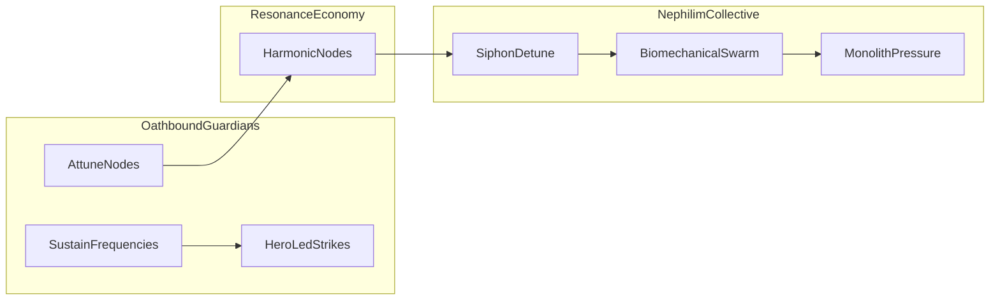

---

## Acoustic Paradigm and Resonance

Resonance replaces ore/credits. Harmonic nodes are **captured and attuned**, not mined out.

| Side | Harvest model | Visual tell |
|---|---|---|
| Guardians | Sustain-frequency collectors | Teal-gold node aura |
| Collective | Corruption siphons | Teal-gold → amber detune |

**Oiketerion Principle:** Watchers act through knowledge and technology only — never innate power. Guardian buffs are externally granted by support-structure frequencies.

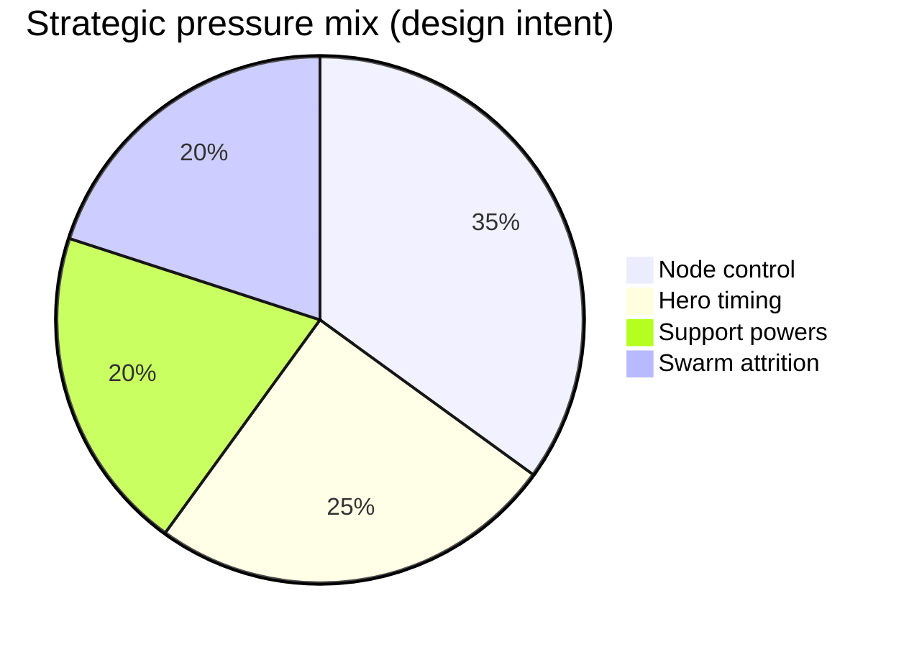

---

## Architecture

OpenRA is a **composition** engine. An Actor is an empty shell; behavior comes from Traits.

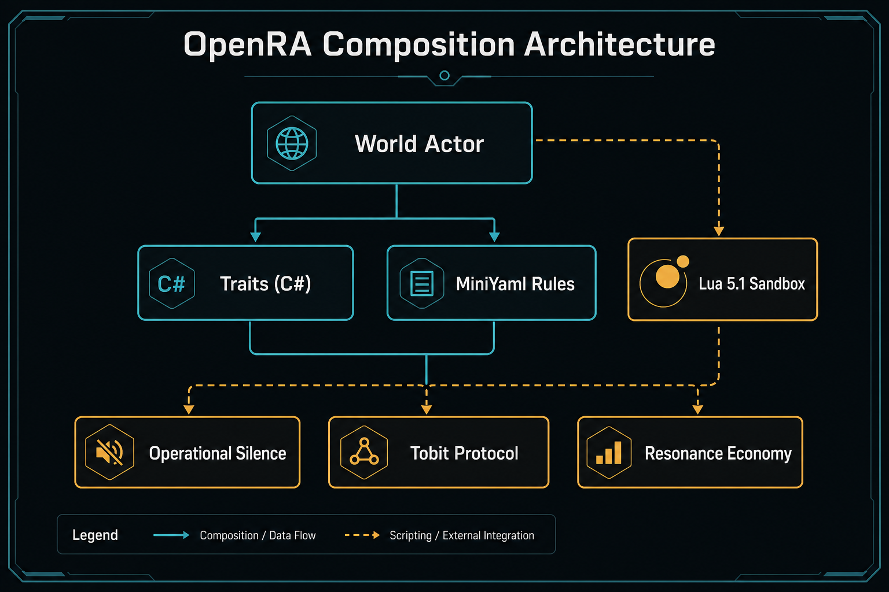

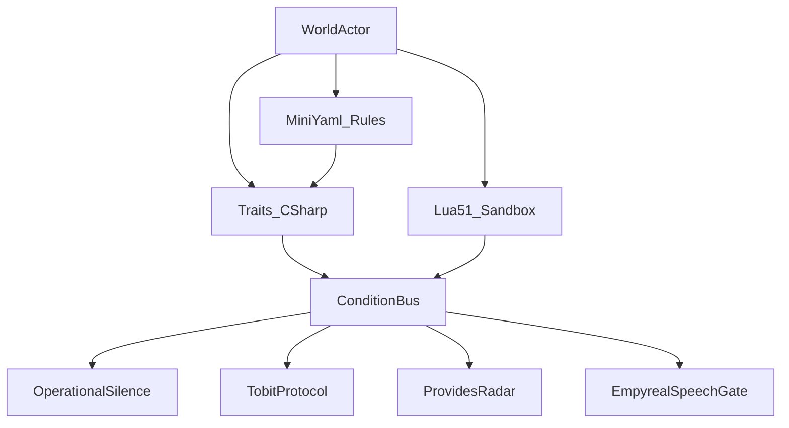

| Layer | Path | Role |
|---|---|---|
| Custom traits | `OpenRA.Mods.Cydonian/` | C# behavior (`TraitInfo` + runtime) |
| Rules | `mods/cydonian/rules/` | Actor composition, balance numbers |
| Sequences | `mods/cydonian/sequences/` | Sprite sheets / facings |
| Audio | `mods/cydonian/audio/` | Weapons, voices, ambients, Tobit speech |
| Campaign Lua | `mods/cydonian/maps/*/` | Mission scripts in the secure sandbox |
| Engine (vendored) | `engine/` | Read-only OpenRA checkout |

**Loop Engineering (mandatory):** after every C# or MiniYaml edit — compile → lint → observe → fix.

| Action | Windows | Linux / macOS |
|---|---|---|
| Rebuild | `.\make.cmd all` | `make` |
| YAML lint | `.\utility.cmd cydonian --check-yaml` | `./utility.sh cydonian --check-yaml` |
| Tests | `.\make.cmd test` | `make test` |
| Launch | `.\launch-game.cmd` | `./launch-game.sh` |

---

## Campaign scripting (Phase J)

The World actor hosts `LuaScript` (Lua 5.1 sandbox). Campaign maps override `Scripts:` with mission modules.

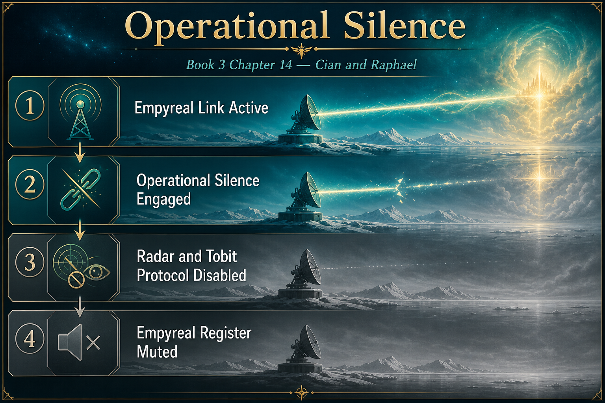

### Operational Silence (Book 3, Chapter 14)

When silence engages, Lua grants `operational-silence` and revokes `empyreal-link`:

| System | Effect |
|---|---|
| Radar | `ProvidesRadar` requires `!operational-silence` |
| Tobit Protocol | `ResonanceSupportPower@TOBIT` requires `empyreal-link && !operational-silence` |
| Empyreal Register | `EmpyrealSpeechGate` + `EmpyrealMedia` mute `TobitProtocol` speech |
| Collectors | Spire resonances require `!operational-silence` |

Raphael / **Liaigh** is never a combat unit — only the late-game **Tobit Protocol** support power (Three Limitations apply).

### Dynamic map events

| Map | Mechanic | API |
|---|---|---|
| `operational-silence-eden` | Eden time dilation | `DateTime.GameTime` + `eden-dilated` → `EdenTimeDilation` |
| `dudael-breach` | Ice-shelf swarm breach | `Trigger.OnEnteredProximityTrigger` + `Actor.Create("AZAZEL.PROXY", …)` |

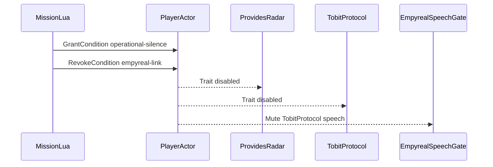

---

## Development roadmap

| Phase | Focus | Status |
|---|---|---|
| A–D | Mod scaffold, Resonance, Celestial Alignment | Shipped |
| E | Dermal Mark Protocol / `AZAZEL.PROXY` | Shipped |
| F | Cian mac Morna Mo Chrá anti-ward | Shipped |
| G | Brennan McNeeve Enochian Faraday Cage | Shipped |
| H | Asset pipeline / sprite sequences | Shipped |
| I | Audio pipeline / VoiceSets / acoustic weapons | Shipped |
| **J** | **Lua campaign / Operational Silence / Dudael** | **Shipped (`15cf594`)** |
| Release | Standalone installers for CODE KickStart | Packaged (`release-20260719`) |

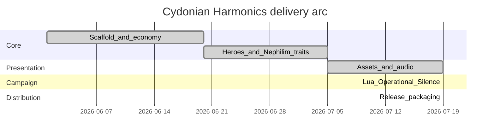

---

## Build and run

### Prerequisites

- .NET SDK compatible with OpenRA `release-20250330` (SDK scripts manage engine fetch)
- Windows: PowerShell; Linux/macOS: `make`, `bash`
- Optional packaging host: Linux/WSL with `makensis`, `wine64`, ImageMagick, `zip`

### Quick start

```powershell
# Windows
.\make.cmd all
.\utility.cmd cydonian --check-yaml
.\launch-game.cmd
```

```bash
# Linux / macOS
make
./utility.sh cydonian --check-yaml
./launch-game.sh
```

---

## Release packaging

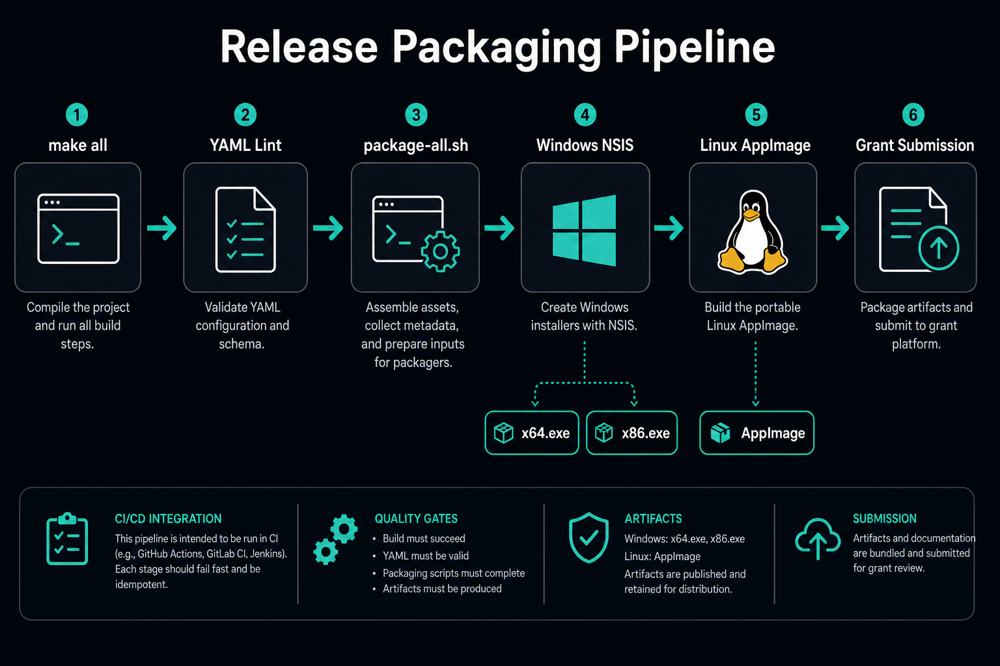

```bash
# Prefer Linux or WSL (NSIS + wine64 required for Windows installers)
mkdir -p packaging/output
bash packaging/package-all.sh release-20260719 "$(pwd)/packaging/output"
```

### Verified artifacts (`release-20260719`)

| Artifact | Approx. size | Path |
|---|---|---|
| Windows x64 NSIS | 33.5 MB | `packaging/output/CydonianHarmonics-release-20260719-x64.exe` |
| Windows x86 NSIS | 30.9 MB | `packaging/output/CydonianHarmonics-release-20260719-x86.exe` |
| Windows x64 portable zip | 44.3 MB | `packaging/output/CydonianHarmonics-release-20260719-x64-winportable.zip` |
| Windows x86 portable zip | 41.2 MB | `packaging/output/CydonianHarmonics-release-20260719-x86-winportable.zip` |
| Linux x86_64 AppImage | 39.9 MB | `packaging/output/CydonianHarmonics-release-20260719-x86_64.AppImage` |

> macOS `.dmg` requires a macOS host. Installer binaries under `packaging/output/` are gitignored — regenerate with the packaging scripts.

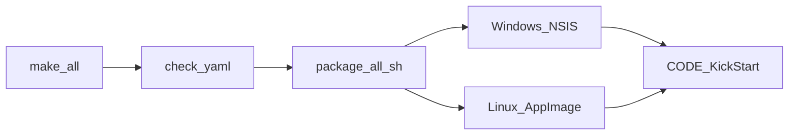

---

## Repository map

```
OpenRA.Mods.Cydonian/   Custom C# trait assembly
mods/cydonian/          Mod manifest, rules, sequences, chrome, audio, maps
packaging/              Mod SDK installer scripts + artwork
docs/images/            README diagrams and key art
.claude/docs/           Lore bible, trait notes, pipelines
.cursor/plans/          Approved architecture plans
engine/                 Vendored OpenRA (not committed; fetched by SDK)
```

---

## Canon hard lines

1. **Binitarian** theology only (Father + Son). No Trinitarian references.
2. **Azazel = Nephilim**, not a Watcher.
3. All supernatural effects trace to the **Acoustic Paradigm**.
4. **Raphael / Liaigh** appears only as the **Tobit Protocol** support power — never a standard combat unit.

Authoritative lore: [`MASTER_LORE_BOOK.md`](MASTER_LORE_BOOK.md), [`.claude/docs/lore-bible.md`](.claude/docs/lore-bible.md).

---

## Governance and contributing

| Document | Purpose |
|---|---|
| [`GOVERNANCE.md`](GOVERNANCE.md) | Decision rights, canon ownership, release process |
| [`CONTRIBUTING.md`](CONTRIBUTING.md) | Dev workflow, Loop Engineering, PR expectations |
| [`CODE_OF_CONDUCT.md`](CODE_OF_CONDUCT.md) | Community standards |
| [`AGENTS.md`](AGENTS.md) | Agent / AI coding constraints |
| [`SECURITY.md`](SECURITY.md) | Vulnerability reporting |
| [`CHANGELOG.md`](CHANGELOG.md) | Shipped milestones |
| [`docs/SESSION.md`](docs/SESSION.md) | Latest session handoff |

---

## Documentation index

| Topic | Location |
|---|---|
| Lua campaign / Operational Silence | [`.claude/docs/lua-campaign.md`](.claude/docs/lua-campaign.md) |
| Audio pipeline | [`.claude/docs/audio-pipeline.md`](.claude/docs/audio-pipeline.md) |
| Render / sprites | [`.claude/docs/render-pipeline.md`](.claude/docs/render-pipeline.md) |
| Custom traits | [`.claude/docs/engine-traits.md`](.claude/docs/engine-traits.md) |
| Strategic blueprint | [`Cydonian_Harmonics_Strategic_Technical_Blueprint.md`](Cydonian_Harmonics_Strategic_Technical_Blueprint.md) |
| Systems / agentic workspace | [`Systems_Engineering_and_Agentic_Workspace_Architecture_for_Cydonian_Harmonics.md`](Systems_Engineering_and_Agentic_Workspace_Architecture_for_Cydonian_Harmonics.md) |

---

## License

The OpenRA engine and Mod SDK scripts are available under the [GNU GPL v3](COPYING). Custom executable code loaded by the engine (C# assemblies, Lua scripts) must use a compatible license. Art, audio, and narrative data may be distributed under separate terms.

---

*Cydonian Harmonics — frequency is the battlefield.*
